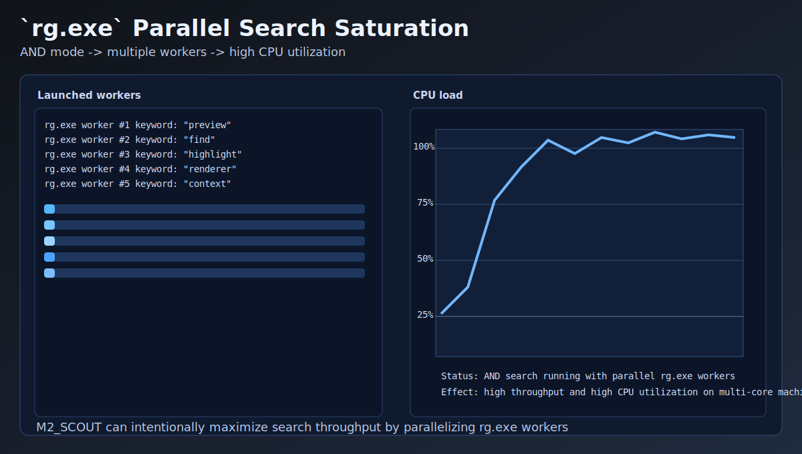

# M2_SCOUT

[English](README.md) | [繁體中文](README.zh-TW.md)

**M2_SCOUT** is a Node.js / Electron port of **M2 SEEK** — a desktop GUI search tool built
on top of [ripgrep](https://github.com/BurntSushi/ripgrep) (`rg`),
[fd](https://github.com/sharkdp/fd), and [cscope](https://cscope.sourceforge.net/).

It is a faithful re-implementation of the original Python/Tkinter app
(`../M2_SEEK.py`). All features are aligned with M2 SEEK. Settings are stored in
its own **INI files** (`M2_SCOUT.ini`, `M2_SCOUT_EXCLUDE_GROUPS.ini`, `M2_SCOUT_HL.ini`).

---

## Animated demo

### Full app workflow animation



This animation highlights the complete user journey:
- multi-tab workflow,
- OR / parallel AND search,
- live FILES updates,
- preview highlight + F3 / Shift+F3,
- in-preview Ctrl+F popup search,
- cscope flow.

### `rg.exe` parallel workers + CPU pressure animation



M2_SCOUT launches multiple `rg.exe` workers in parallel for AND mode and can drive CPU usage very high on large repositories.

### Legacy preview-only animation



---

## Quick start

```powershell
cd M2_SCOUT
npm install      # first time only (downloads Electron)
npm start        # launch the app
# optional: pre-fill a folder
npm start -- "C:\CODE\UEFI\Devices0522"
```

Or just double-click **`M2_SCOUT.cmd`** (installs deps on first run, then launches).

### Tools (`rg.exe`, `fd.exe`, `cscope`)

M2_SCOUT resolves the executables in this order:

1. the value typed in the **rg.exe / fd.exe** fields (absolute path wins),
2. the M2_SCOUT folder,
3. the parent folder (`../`, the original M2_SEEK repo that already ships
   `rg.exe`, `fd.exe`, `cscope.exe`),
4. the system `PATH`.

So out of the box it reuses the binaries already present in the M2_SEEK repo.

---

## Building the installer

M2_SCOUT packages with [electron-builder](https://www.electron.build/) into an
**interactive Windows installer (NSIS)**. The bundled `TOOLS/`, `FONTS/`, `LOGO/`,
the INI templates and `context-menu.ps1` are copied next to `M2_SCOUT.exe`, and
settings are written back there at runtime. The default per-user install location
(`%LOCALAPPDATA%\Programs\M2_SCOUT`) is writable, so the INI-next-to-exe model keeps
working.

```powershell
npm install     # first time (adds electron-builder)
npm run pack    # unpacked build   -> dist/win-unpacked/M2_SCOUT.exe (CI smoke test)
npm run dist    # NSIS installers  -> dist/M2_SCOUT-Setup-<version>-<arch>.exe (x64 + arm64)
```

The app/installer/shortcut/uninstaller icon is `LOGO/M2_SCOUT.ico` (a multi-size
ICO incl. 256px, required by NSIS). Replace that file (keeping the name and a 256px
entry) to rebrand.

### What the installer does

- Shows an **interactive** wizard (welcome → choose folder → progress → finish);
  it is **not** a silent one-click install.
- Applies the **M2_SCOUT logo** to the exe, Start-menu / desktop shortcuts, and the
  uninstaller.
- Registers the Explorer **right-click "search this folder" menu** pointing at the
  freshly installed exe. Any previous entry (a dev checkout or an older install) is
  **removed first**, so the menu always targets the installed app. Uninstalling
  removes the menu. The Chinese menu label is emitted from Unicode code points in
  the ASCII-only [`context-menu.ps1`](context-menu.ps1), and the NSIS hook
  ([`build/installer.nsh`](build/installer.nsh)) is pure ASCII — no mojibake.

### Continuous build & release (GitHub Actions)

| Workflow | Trigger | What it does |
|---|---|---|
| [`build.yml`](.github/workflows/build.yml) | every push / PR to `main` | `npm ci`, JS syntax check, `npm run pack`, verify the exe ships with TOOLS/FONTS/LOGO/INI/context-menu.ps1, upload the unpacked build |
| [`release.yml`](.github/workflows/release.yml) | pushing a `v*` tag | build the x64 + arm64 NSIS installers and attach `M2_SCOUT-Setup-<version>-x64.exe` / `-arm64.exe` to a GitHub Release |

### Cutting a release

The release helper auto-provisions missing tooling (git / node / npm via winget),
verifies or publishes, and prefers the CI tag-push path:

```powershell
# verify the build packages cleanly (publishes nothing):
pwsh scripts/release.ps1 -Version 0.0.1

# bump + commit + tag + push -> CI builds & publishes the installer:
pwsh scripts/release.ps1 -Version 0.0.1 -Publish
#   or auto-increment:  pwsh scripts/release.ps1 -Bump patch -Publish
```

In Copilot Chat you can just say **"我要 RELEASE v0.0.1"** — the `m2scout-release`
skill runs this flow for you.

---

## Feature parity with M2 SEEK

| Area | M2 SEEK (Python/Tk) | M2_SCOUT (Node/Electron) |
|------|---------------------|------------------------|
| Multi-tab UI | ✅ notebook tabs | ✅ tab bar (Ctrl+T / Ctrl+W, drag to reorder) |
| Content search (ripgrep) | ✅ `--json --stats --fixed-strings` | ✅ identical args |
| OR / AND keyword modes | ✅ | ✅ |
| Parallel AND | ✅ concurrent `rg` | ✅ concurrent spawns |
| Case sensitive toggle | ✅ | ✅ |
| Respect ignore files | ✅ `--no-ignore` when off | ✅ |
| Include filter globs | ✅ | ✅ |
| Exclude dirs/files (manual) | ✅ | ✅ |
| Exclude **groups** (INI keys) | ✅ `exd_* / exf_*` | ✅ same resolution rules |
| Live FILES list while searching | ✅ throttled | ✅ throttled (80 ms) |
| STOP button / ESC | ✅ kills `rg` | ✅ kills child processes |
| Filename search (fd) | ✅ | ✅ |
| Preview ±10 lines, merged blocks | ✅ | ✅ |
| Syntax highlight (HL INI) | ✅ Tk tags | ✅ DOM spans, same priority layering |
| Keyword highlight + F3 next / Shift+F3 prev | ✅ | ✅ |
| Preview in-pane find (Ctrl+F popup + count + next/prev) | ❌ | ✅ |
| Editor integration (open at line) | ✅ template `$(FILEPATH)/$(LINENUM)` | ✅ same template, 740-elevation fallback |
| FILES HL / Filter coloring | ✅ F2/F3/F4 | ✅ F2/F3/F4 |
| F1 copy all results | ✅ | ✅ |
| Preview zoom Ctrl +/- | ✅ | ✅ |
| GEN cscope.files | ✅ | ✅ |
| CSCOPE window (index + 9 modes) | ✅ | ✅ separate window |
| DEBUG panel | ✅ collapsible | ✅ collapsible |
| INI persistence | ✅ default tab | ✅ default tab (`TAB BASE`) |

### Hotkeys

| Key | Action |
|-----|--------|
| `Ctrl+F` | focus Keywords |
| `Ctrl+D` | focus Filter |
| `Enter` (Keywords/Filter) | run search |
| `Esc` | stop running search |
| `Ctrl+T` / `Ctrl+W` | new / close tab |
| `Alt+Down` | focus FILES list |
| `Ctrl+Right` | focus Preview first match |
| FILES `F1/F2/F3/F4` | copy all / HL / Dim / clear |
| Preview `F3` / `Shift+F3` | next / previous keyword match |
| Preview `Ctrl+F` | open in-preview floating find box |
| Preview find `Enter` / `Shift+Enter` | next / previous in-preview match |
| Preview `Ctrl + / Ctrl -` | zoom |
| Preview right-click | open in editor at clicked line |

---

## Extra features (beyond M2 SEEK)

M2_SCOUT-only additions layered on top of the M2 SEEK feature set. Most live in
the **Settings (⚙)** popup on the tab bar.

### App self-update

In **Settings (⚙)** click **Check for update**. M2_SCOUT compares the running
version against the latest [GitHub Release](https://github.com/M2Station/M2_SCOUT/releases)
and, when a newer one exists:

1. **prompts** you with current vs. latest version,
2. **downloads** the NSIS installer matching your CPU architecture
   (`M2_SCOUT-Setup-<version>-x64.exe` / `-arm64.exe`),
3. **launches** it (the installer replaces the app and relaunches it), and
4. **deletes** the downloaded installer on the next startup.

### Tool auto-update (rg / fd)

The **Check update** button beside each `rg.exe` / `fd.exe` field fetches the
latest ripgrep / fd Windows release from GitHub and installs the matching
binary into `TOOLS/`. The target platform (x86_64 / aarch64) is set in Settings.

### Themes & languages

- **5 built-in themes** — Daylight (Light), Low Key (Dark), VS Code (Dark),
  Army, Army (Dark). Remembered across runs and painted before the first frame
  (no flash of the wrong theme).
- **Bilingual UI** — English and Traditional Chinese, switched live in Settings.

### FILES list extras

- **List / Tree** view toggle and **sort by name or match count**.
- **Keyword search history** popup (recent keywords, deduped, newest first).

### Beyond Compare integration

Select two files in the FILES list and right-click to diff them in **Beyond
Compare** (auto-detected across installed versions).

### Bundled font auto-install

The `Source Code Pro` font in `FONTS/` is installed per-user on startup (no
admin rights on Windows 10 1809+) so the UI font stack always resolves.

---

## Project structure

```
M2_SCOUT/
├─ package.json
├─ M2_SCOUT.cmd               launcher (npm install + start)
├─ M2_SCOUT.ini               settings (INI format)
├─ M2_SCOUT_EXCLUDE_GROUPS.ini exclude group definitions
├─ M2_SCOUT_HL.ini            syntax highlight rules
└─ src/
   ├─ main/                   Electron main process (Node backend)
   │  ├─ main.js              window lifecycle + startup cleanup
   │  ├─ ipc.js               all IPC handlers
   │  ├─ config.js            constants (ported config classes)
   │  ├─ paths.js             app dir + exe resolver
   │  ├─ ini.js               configparser-compatible INI read/write
   │  ├─ utils.js             token/keyword parsing
   │  ├─ globs.js             rg include/exclude glob builders
   │  ├─ excludeGroups.js     group key resolution
   │  ├─ rg.js                ripgrep arg builder
   │  ├─ search.js            content search orchestrator (OR / parallel AND)
   │  ├─ fd.js                filename search
   │  ├─ cscope.js            cscope index / query / preview
   │  ├─ preview.js           preview text builder
   │  ├─ editor.js            editor template + launch
   │  ├─ highlight.js         HL rule compiler
   │  ├─ fonts.js             bundled font auto-install (per-user)
   │  ├─ fsdialog.js          in-app folder browser backend
   │  ├─ toolUpdate.js        ripgrep / fd updater
   │  └─ appUpdate.js         M2_SCOUT self-updater
   ├─ preload/preload.js      contextBridge API (window.m2scout)
   └─ renderer/
      ├─ index.html           main window
      ├─ cscope.html          CSCOPE window
      ├─ css/style.css
      └─ js/
         ├─ renderer.js       tabs, search lifecycle, files, preview, hotkeys
         ├─ highlight.js      client-side syntax/keyword highlighter
         ├─ cscope.js         CSCOPE window logic
         ├─ i18n.js           English / Traditional Chinese strings
         ├─ themes.js         theme registry (5 themes)
         ├─ settings.js       Settings popup (language / theme / update)
         ├─ history.js        keyword search history
         ├─ folderPicker.js   keyboard-driven folder picker
         ├─ excludePicker.js  exclude-groups picker
         └─ editorPicker.js   editor chooser
```

---

## Architecture notes

- **Main process** owns all OS access: spawning `rg`/`fd`/`cscope`, reading/writing
  INI files, building previews, and launching the editor. It streams search
  events to the renderer over a single `search:event` IPC channel keyed by a
  per-tab `sessionId`.
- **Renderer** is sandboxed (`contextIsolation: true`, `nodeIntegration: false`)
  and talks to the backend only through the `window.m2scout` bridge defined in
  `preload.js`.
- Preview match detection uses literal (fixed-string) matching in JS, which is
  equivalent to ripgrep's `--fixed-strings` mode used by the search.

### Intentional differences

- The original shows live **CPU%** of the `rg` process via `psutil`. M2_SCOUT
  shows the machine's overall **system CPU%** instead, sampled natively from
  Node's `os.cpus()` in the main process (no per-child sampling dependency) and
  pushed to the window continuously, so it stays live even when idle.
- Tk text tags are reproduced with layered DOM spans; foreground precedence
  follows the same tag priority order as M2 SEEK.

---

## License

MIT. "Powered By OA Hsiao".
